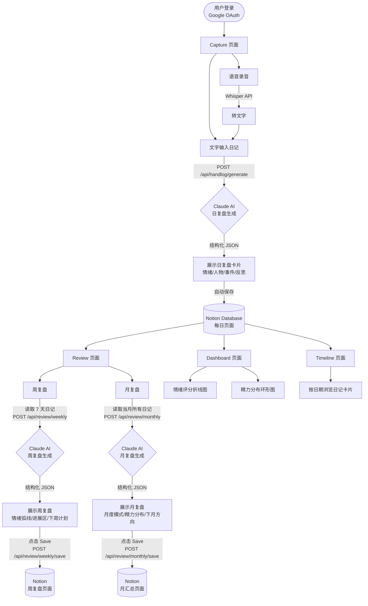

# HandLog ✍️

**HandLog** 是一款 AI 驱动的个人日记复盘工具，帮助你把每天的文字记录，自动提炼成日/周/月结构化复盘报告，并同步保存到 Notion。

🔗 **Live Demo**: [hand-log.vercel.app](https://hand-log.vercel.app)
📄 **静态演示**: 打开 [`handlog-demo.html`](./handlog-demo.html) 即可在浏览器中查看所有页面效果

---

## 功能概览

| 页面 | 功能 |
|------|------|
| **Capture（录入）** | 语音/文字输入当日日记，AI 生成结构化日复盘 |
| **Review（复盘）** | 一键生成周复盘 / 月复盘，保存到 Notion |
| **Dashboard（看板）** | 可视化情绪评分走势、精力分布图表 |
| **Timeline（时间线）** | 按时间轴浏览所有日记卡片 |

---

## 系统流程图



---

## 技术栈

- **框架**: [Next.js 14](https://nextjs.org) (App Router)
- **语言**: TypeScript
- **AI**: [Claude claude-sonnet-4-6](https://anthropic.com) — 日/周/月复盘结构化生成
- **语音转录**: OpenAI Whisper API
- **数据存储**: [Notion API](https://developers.notion.com) — 日记数据库 + 复盘页面
- **认证**: NextAuth.js (Google OAuth + 邮箱白名单)
- **部署**: [Vercel](https://vercel.com)

---

## 本地运行

```bash
# 安装依赖
npm install

# 配置环境变量（参考下方说明）
cp .env.example .env.local

# 启动开发服务器
npm run dev
```

访问 [http://localhost:3000](http://localhost:3000)

---

## 环境变量

在 `.env.local` 中配置以下变量：

```env
# Anthropic Claude API
ANTHROPIC_API_KEY=

# OpenAI Whisper（语音转录）
OPENAI_API_KEY=

# Notion 集成
NOTION_TOKEN=
NOTION_DATABASE_ID=

# NextAuth（Google OAuth）
GOOGLE_CLIENT_ID=
GOOGLE_CLIENT_SECRET=
NEXTAUTH_SECRET=
NEXTAUTH_URL=http://localhost:3000

# 访问白名单（逗号分隔邮箱）
ALLOWED_EMAIL=
```

---

## 项目结构

```
src/
├── app/
│   ├── [locale]/
│   │   ├── capture/        # 日记录入页
│   │   ├── review/         # 周/月复盘页
│   │   ├── dashboard/      # 数据看板
│   │   └── timeline/       # 时间线
│   └── api/
│       ├── handlog/generate/   # 日复盘生成
│       ├── review/weekly/      # 周复盘生成
│       ├── review/weekly/save/ # 周复盘保存到 Notion
│       ├── review/monthly/     # 月复盘生成
│       ├── review/monthly/save/# 月复盘保存到 Notion
│       ├── transcribe/         # 语音转文字
│       ├── dashboard/          # 看板数据
│       └── timeline/           # 时间线数据
├── lib/
│   ├── claude.ts           # Claude API 调用 + JSON 解析
│   └── notion.ts           # Notion 读写封装
└── prompts/
    ├── daily-review.md     # 日复盘 prompt 模板
    ├── weekly-review.md    # 周复盘 prompt 模板
    └── monthly-review.md   # 月复盘 prompt 模板
```
