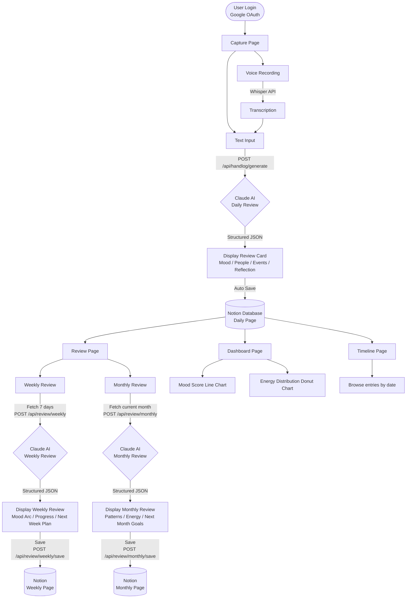

# HandLog ✍️

**HandLog** is an AI-powered journaling and reflection tool that transforms your daily notes into structured daily / weekly / monthly reviews, automatically saved to Notion.

🔗 **Live Demo**: [hand-log.vercel.app](https://hand-log.vercel.app)
📄 **Static Demo**: Open [`handlog-demo.html`](./handlog-demo.html) locally to preview all pages
🇨🇳 **中文文档**: [README_CN.md](./README_CN.md)

---

## Features

| Page | Description |
|------|-------------|
| **Capture** | Voice or text input, AI generates a structured daily review |
| **Review** | One-click weekly / monthly review generation, saved to Notion |
| **Dashboard** | Visualise mood trends and energy distribution over time |
| **Timeline** | Browse all journal entries in chronological order |

---

## Architecture



---

## Tech Stack

- **Framework**: [Next.js 14](https://nextjs.org) (App Router)
- **Language**: TypeScript
- **AI**: [Claude Sonnet](https://anthropic.com) — structured daily / weekly / monthly review generation
- **Voice Transcription**: OpenAI Whisper API
- **Storage**: [Notion API](https://developers.notion.com) — journal database + review pages
- **Auth**: NextAuth.js (Google OAuth + email whitelist)
- **Deployment**: [Vercel](https://vercel.com)

---

## Getting Started

```bash
# Install dependencies
npm install

# Set up environment variables
cp .env.example .env.local

# Start development server
npm run dev
```

Open [http://localhost:3000](http://localhost:3000)

---

## Environment Variables

```env
# Anthropic Claude API
ANTHROPIC_API_KEY=

# OpenAI Whisper (voice transcription)
OPENAI_API_KEY=

# Notion integration
NOTION_TOKEN=
NOTION_DATABASE_ID=

# NextAuth (Google OAuth)
AUTH_GOOGLE_ID=
AUTH_GOOGLE_SECRET=
NEXTAUTH_SECRET=
NEXTAUTH_URL=http://localhost:3000

# Email whitelist
ALLOWED_EMAIL=

# Encryption key (run: openssl rand -hex 32)
ENCRYPTION_KEY=

# Notion OAuth (if using OAuth flow)
NOTION_CLIENT_ID=
NOTION_CLIENT_SECRET=
NOTION_REDIRECT_URI=http://localhost:3000/api/auth/callback/notion
```

---

## Project Structure

```
src/
├── app/
│   ├── [locale]/
│   │   ├── capture/        # Journal entry page
│   │   ├── review/         # Weekly / monthly review page
│   │   ├── dashboard/      # Data dashboard
│   │   └── timeline/       # Timeline view
│   └── api/
│       ├── handlog/generate/    # Daily review generation
│       ├── review/weekly/       # Weekly review generation
│       ├── review/weekly/save/  # Save weekly review to Notion
│       ├── review/monthly/      # Monthly review generation
│       ├── review/monthly/save/ # Save monthly review to Notion
│       ├── transcribe/          # Voice to text
│       ├── dashboard/           # Dashboard data
│       └── timeline/            # Timeline data
├── lib/
│   ├── claude.ts           # Claude API + JSON parsing
│   └── notion.ts           # Notion read/write helpers
└── prompts/
    ├── daily-review.md     # Daily review prompt template
    ├── weekly-review.md    # Weekly review prompt template
    └── monthly-review.md   # Monthly review prompt template
```
